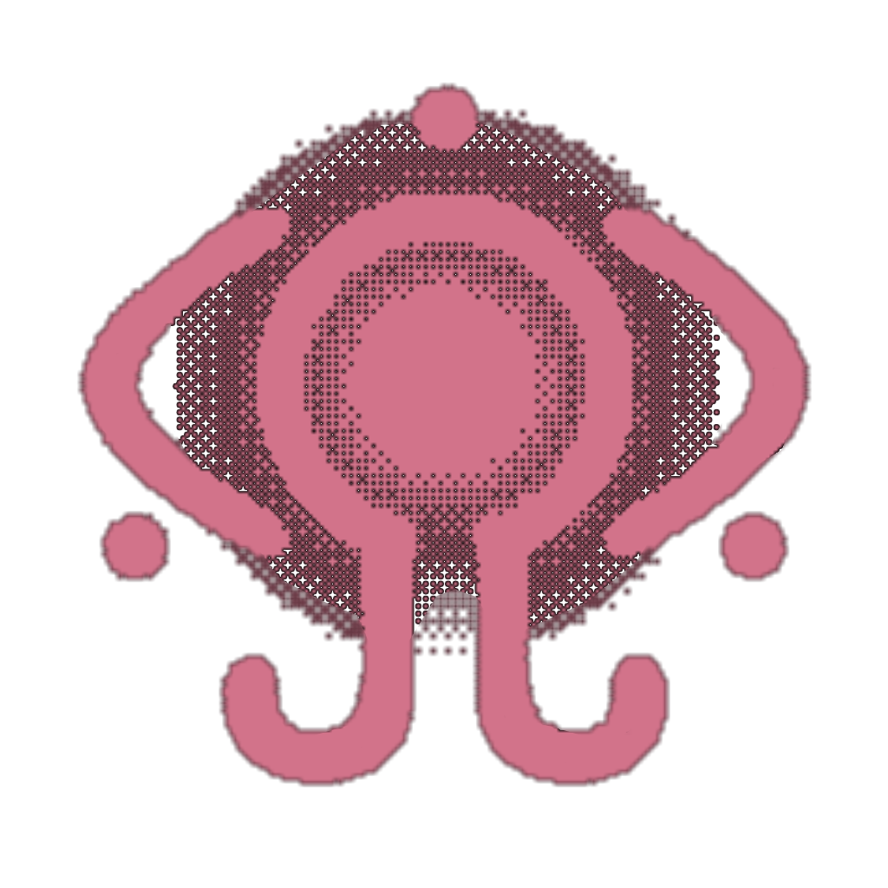

<div align="center">
  

  <h1>NAVI</h1>
  <p><strong>PRESENT DAY // PRESENT TIME</strong></p>
  <p>A Serial Experiments Lain-inspired cyberpunk workspace for AI chat, image creation, and interactive 3D.</p>
</div>

---

NAVI brings conversation and creative tools together in a terminal-like interface for the Wired.

## Modes

| Mode | What it does |
| --- | --- |
| **CHAT** | Stream conversations, keep browser-saved sessions, and attach an image for visual analysis. |
| **IMAGE** | Generate images or edit a composition using up to four reference images. |
| **3D** | Generate a model from text or an image, then inspect and manipulate it in the browser. Supports GLB, FBX, and OBJ previews. |

Generated 3D artifacts are cached in the browser with IndexedDB for later local access.

## Built With

Next.js 15, React 19, TypeScript, Tailwind CSS, Radix UI, and Three.js. Cloudflare Workers deployment is configured through OpenNext.

## Run Locally

**Requirements:** Node.js 20.19 or newer and pnpm.

```bash
pnpm install --frozen-lockfile
pnpm dev
```

Open `http://localhost:3000`. The app's `/api` route forwards chat, image, and 3D requests to `api.arcangelo.net`, which must be reachable for generation features.

## Project Layout

```text
app/                  Next.js app and unified API route
components/           Chat, image, and 3D workspaces
components/ui/        Shared interface components
hooks/                Application hooks
lib/                  Browser storage and utilities
public/               Static assets and Darkwired mark
```

<div align="center">

### Support

[](https://github.com/ARCANGEL0/NekoGPT)
[](https://github.com/ARCANGEL0)

<a href='https://ko-fi.com/J3J7WTYV7' target='_blank'></a>

<strong>Hack the world. Byte by Byte.</strong> ⛛ <br>
𝝺𝗿𝗰𝗮𝗻𝗴𝗲𝗹𝗼 @ 2026

</div>
